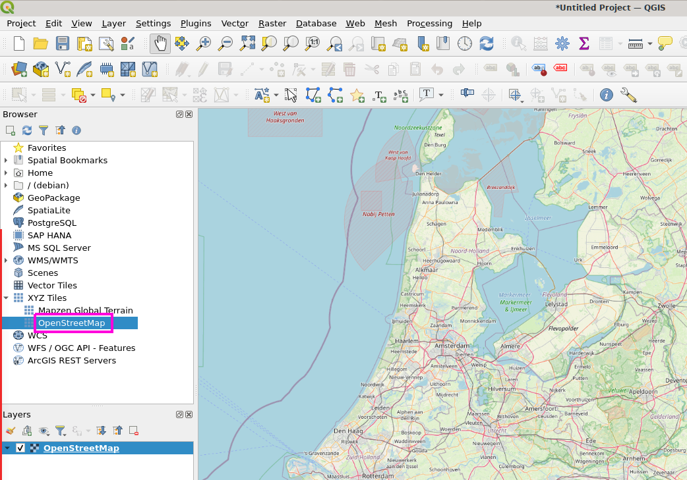
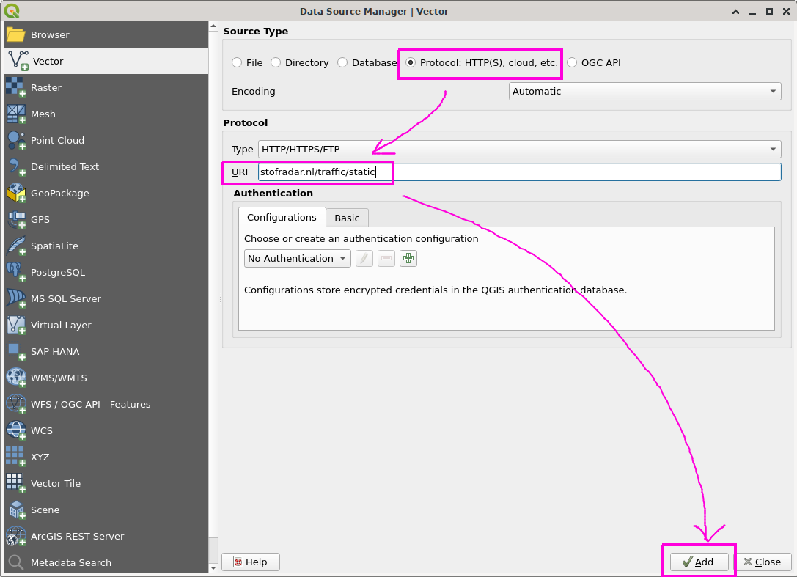
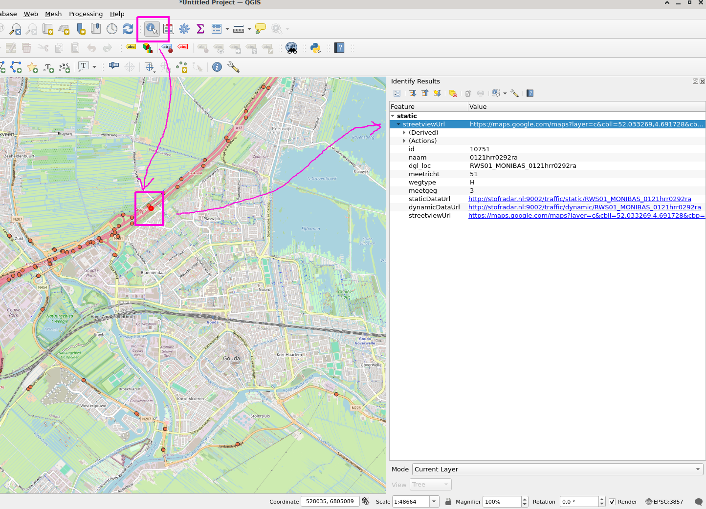

# verkeersdrukte
Java application to serve traffic data from NDW in a friendly format

## Usage in QGIS
The software presents a shape file in GeoJSON format that can be imported into QGIS.
Each point in the GeoJSON represents a measurement site,
and contains all properties of the original shape file,
plus URLs to the static data (fixed properties), dynamic data (traffic speed and flow) and a link to Google streetview.

First, add an openstreet background layer,
by clicking XYZ Tiles / OpenStreetMap

Then, add a vector layer,  by opening menu
Layer / Add Layer / Add Vector Layer ...

The URL is https://stofradar.nl/traffic/static
Click 'Add', then 'Close'.

You should now see all measurement sites on the map.
Select a particular site using the 'Identify features' button.

This shows the static information about the measurement site,
including an URL to the dynamic information. For example:
http://stofradar.nl:9002/traffic/dynamic/RWS01_MONIBAS_0121hrr0292ra

The URL to the SSE event stream has '/events' appended:
http://stofradar.nl:9002/traffic/dynamic/RWS01_MONIBAS_0121hrr0292ra/events
