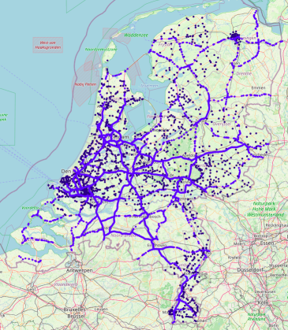

# verkeersdrukte
Java application to serve traffic data from NDW in a friendly format

See https://stofradar.nl/traffic for the live map.

You can access the underlying data by zooming in, clicking a measurement location and noting the site name,
for example RWS01_MONIBAS_0121hrr0292ra.

Each measurement location has a couple of endpoint associated with it, for example:
* Static data: https://stofradar.nl/traffic/static/RWS01_MONIBAS_0121hrr0292ra
* Dynamic data, new data every minute: https://stofradar.nl/traffic/dynamic/RWS01_MONIBAS_0121hrr0292ra
* SSE event stream with live data: https://stofradar.nl/traffic/dynamic/RWS01_MONIBAS_0121hrr0292ra/events
